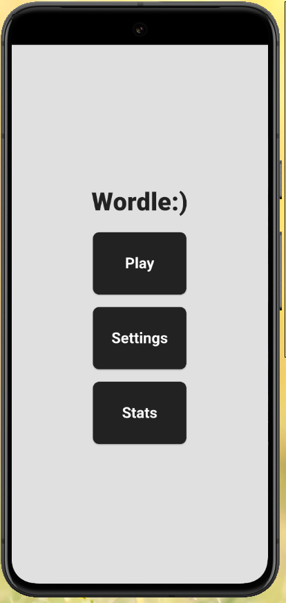
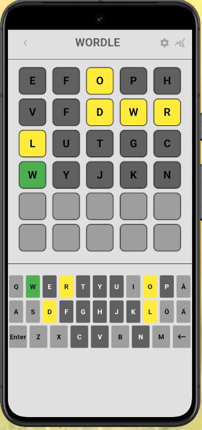
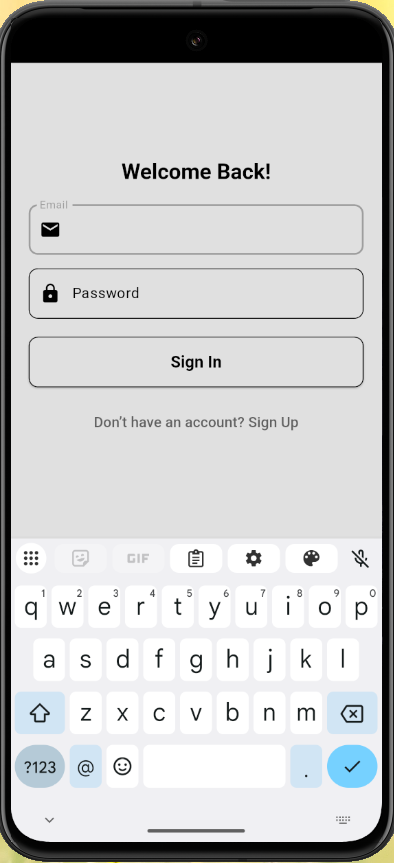
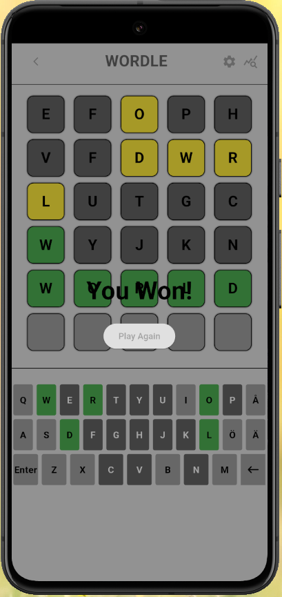

# Wordle Clone

A Flutter-based clone of the popular word game **Wordle**. This project allows players to guess a five-letter word within a limited number of attempts.

## 🚀 Features

- 🎨 **Beautiful UI**: A clean and user-friendly interface.
- 🎮 **Interactive Gameplay**: Players can input letters, delete them, and submit their guesses.
- ✅ **Word Validation**: Colors indicate correct letters, misplaced letters, and incorrect letters.
- 🎹 **Custom Keyboard**: Displays letter statuses dynamically.
- 🏆 **Win Condition**: Shows a victory overlay when the correct word is guessed.


## 📸 Screenshots

Here are some screenshots of the application:

| Home Page | Game Screen |
|-----------|------------|
|  |  |

| Login Screen | Winning Screen |
|-------------|---------------|
|  |  |


## 🛠️ Installation

### Prerequisites
- Flutter SDK (latest stable version)
- Dart
- A device/emulator to run the app

### Steps
```sh
# Clone this repository
git clone https://github.com/simonjonsson1999/wordle_clone.git
cd wordle_clone

# Install dependencies
flutter pub get

# Run the app
flutter run
```

## 🎮 How to Play
1. Enter a 5-letter word using the on-screen keyboard.
2. Press "Enter" to submit your guess.
3. The colors will indicate correctness:
   - 🟩 **Green**: Correct letter, correct position.
   - 🟨 **Yellow**: Correct letter, wrong position.
   - ⬜ **Gray**: Letter not in the word.
4. Keep guessing until you find the word or run out of attempts!

## 🔧 To-Do
-  Implement a word dictionary for validation.
-  Support different word lengths and difficulty levels.
-  Get word of the day from API or word list.
